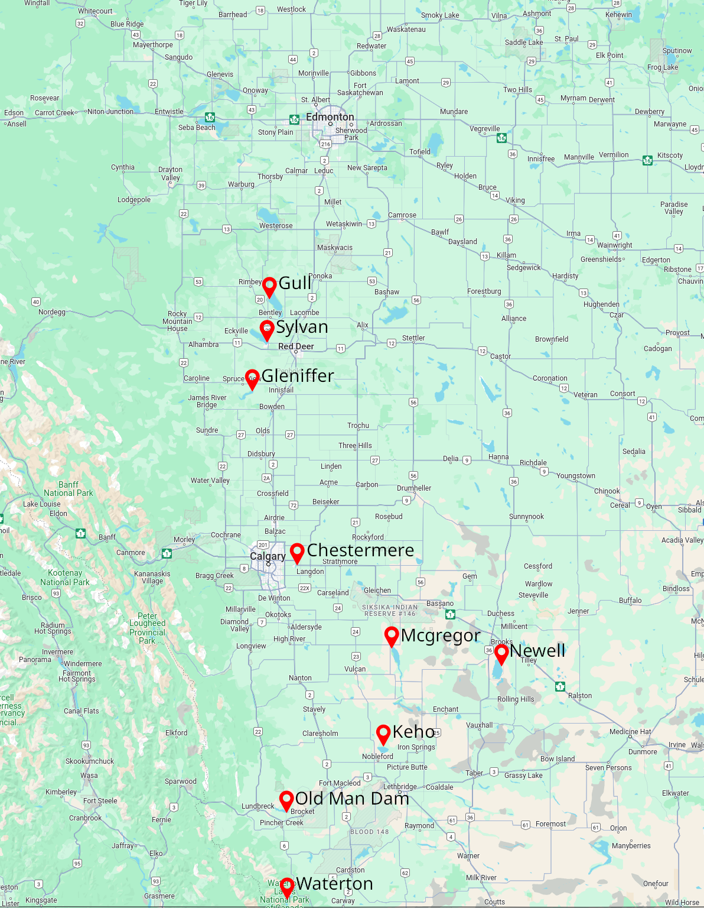
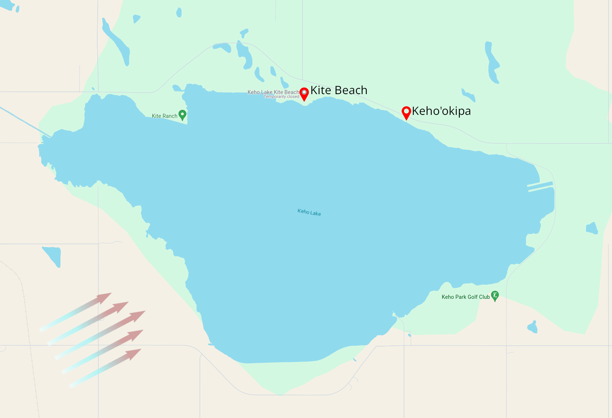
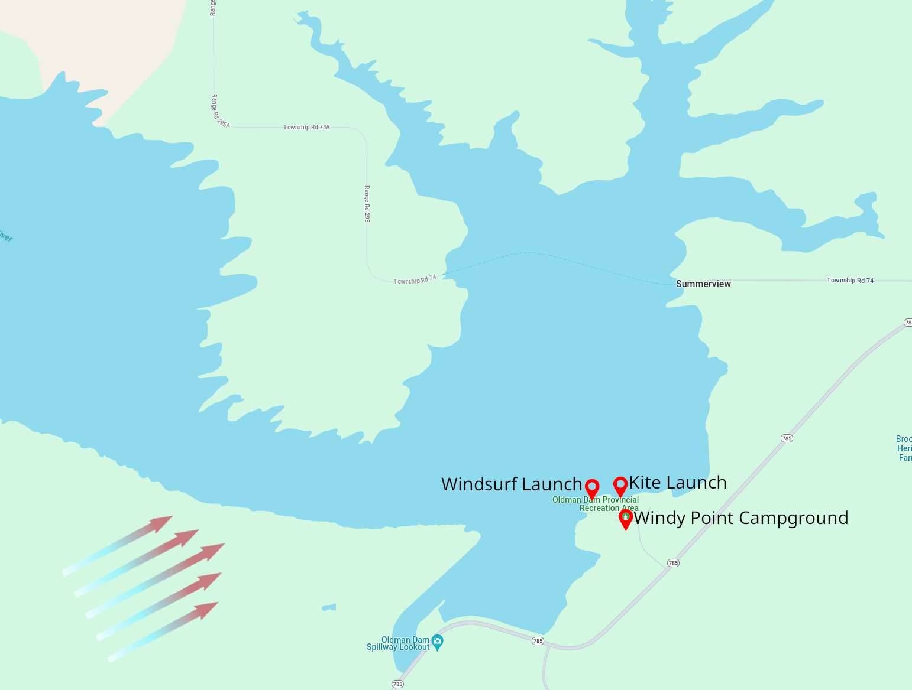

+++
title = "Alberta Windsurfing Guide"
date = 2024-01-15

[taxonomies]
tags = ["Windsurfing"]
+++

Southern Alberta is one of the windiest regions in Canada[[0]](https://ec.gc.ca/meteo-weather/default.asp?lang=En&n=774B5B53-1). Winds commonly range between 20 and 40 knots, and have been measured as high as 95[[2]](https://en.wikipedia.org/wiki/Pincher_Creek#Climate). For perspective, a hurricane is _just_ 64 knots[[3]](https://en.wikipedia.org/wiki/Beaufort_scale#Modern_scale).

_This makes for great windsurfing._

<!-- more -->

Keho lake at 40kts

# Beginners

While strong winds exist in Alberta, there are plenty of days suitable for beginners. If you are a beginner, I am happy to provide guidance. Look for my email in the about page!

# Community

There is a small but passionate community, usually found on the water when it's windy. Very syncronized, but not through deliberate coordonation. The wind forcast brings us together.

We do have a [WhatsApp group](https://chat.whatsapp.com/E2olLC3avjCAQcGlN9QZMr) though, and there's a larger [kite facebook group](https://m.facebook.com/groups/441349399311580), which accepts windsurfers.

# Guide

This guide focuses on the main Windsurfing spots in Alberta:

## Keho Lake

Keho is the first of two major Windsurfing spots. It is situated well within the strong Southern Alberta wind systrem, and is large enough for swells to form at 30kts+. On a strong day, Keho is considered the most challenging place to sail.

### Wind

SW Wind is best. This is the typical Southern Alberta system. Anything else is unusual, and potentually unreliable.

### Launching
- **Kite Beach**: Kiters maintain this launch, but Windsurfers are welcome. Slightly up wind, so the waves are smaller.
- **Keho'okipa**: This is where most Windsurfers will launch from and hang out. Slightly down wind, so the waves are larger.

# Old Man Dam

Old Man Dam is the second of two major Windsurfing spots - again situated well within the strong Southern Alberta wind system. Old Man can get marginally stronger wind than Keho, but has less waves due to it being a smaller body of water.

Overnighting is permitted [with a permit](https://www.albertaparks.ca/parks/south/oldman-dam-pra/information-facilities/camping/windy-point/)

### Wind

SW Wind is best, same as Keho.

### Launching
- **Windsurf Launch**: Windsurfers typically launch upwind of the trees. It's a nice launch that kiters avoid because of the trees.

.\
.\
.\
.\
.\
.\
More to come (This is a WIP that I will contribute to when I have time)
